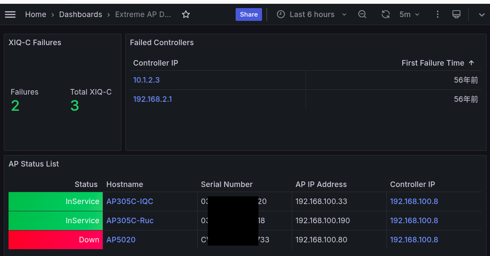

# xccmond  

[](https://deepwiki.com/tknv/xccmond)  


## usage

### start

git clone it, then edit `exporter/targets.csv`    
and start `docker-compose up`  

### clean up

```bash
docker container stop $(docker container ls -aq) && docker container rm $(docker container ls -aq) && docker rmi -f $(docker images -aq) && docker volume rm $(docker volume ls -q) && docker network rm $(docker network ls | awk '{print $1}' | grep -v 'ID\|bridge\|host\|none')
```

### related license 

[https://github.com/grafana/grafana/blob/main/LICENSE](https://github.com/grafana/grafana/blob/main/LICENSE)  
[https://github.com/prometheus/prometheus/blob/main/LICENSE](https://github.com/prometheus/prometheus/blob/main/LICENSE)  

