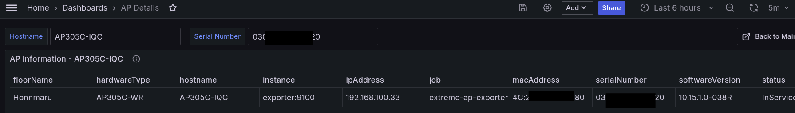

# xccmond  

[](https://deepwiki.com/tknv/xccmond)  
Main  
 
AP Detail   
  

## usage

### start

git clone it, then edit `exporter/targets.csv`    
and start `docker-compose up`  

### tune  

`prometheus/prometheus.yml` 

```bash
global:
  scrape_interval: 5m
  scrape_timeout: 120s
```  

Prometheus get data from memory per 5 min.  This time-out is 120s.  

`exporter/exporter.py`  

```python
POLLING_INTERVAL = 300
REQUEST_TIMEOUT = 10
MAX_WORKERS = 50
```  

Every 300 sec, call the API. This time-out is 10 sec.  
E.g. 500 targets, 50 parallel workers 10 times. Thus 10 x 10 seconds could spend.   

### clean up

```bash
docker container stop $(docker container ls -aq) && docker container rm $(docker container ls -aq) && docker rmi -f $(docker images -aq) && docker volume rm $(docker volume ls -q) && docker network rm $(docker network ls | awk '{print $1}' | grep -v 'ID\|bridge\|host\|none')
```

### related license 

[https://github.com/grafana/grafana/blob/main/LICENSE](https://github.com/grafana/grafana/blob/main/LICENSE)  
[https://github.com/prometheus/prometheus/blob/main/LICENSE](https://github.com/prometheus/prometheus/blob/main/LICENSE)  
[Apache License 2.0](https://github.com/apache/httpd/blob/trunk/LICENSE)  


